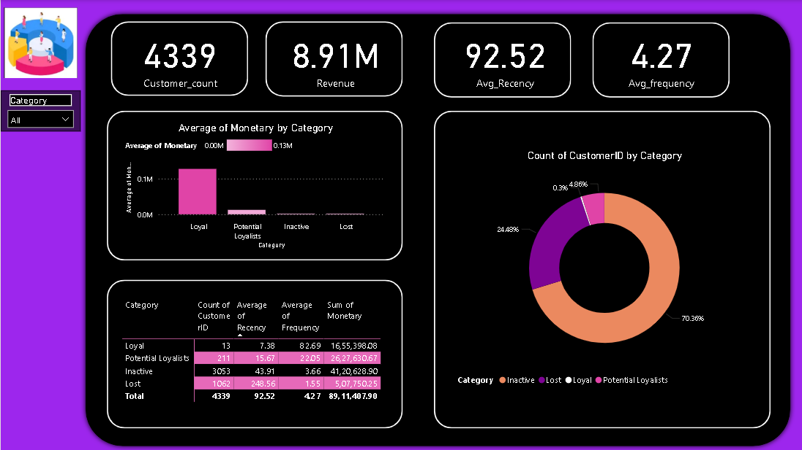

# 🧩 Customer Segmentation using RFM Analysis — Online Retail Dataset

### 👨‍💻 Author: [Lokesh](https://www.linkedin.com/in/lokesh1000/)  
📧 lokeshsivakumar13@gmail.com  

---

## 📊 Project Overview
This project focuses on **Customer Segmentation** for an Online Retail business using the **RFM (Recency, Frequency, Monetary)** model.  
The objective was to identify customer behavior patterns and group customers into meaningful segments for **targeted marketing** and **retention strategies**.

---

## 🛠️ Tools & Technologies
- **Python:** Pandas, NumPy, Matplotlib, Scikit-learn  
- **Power BI:** Interactive dashboard design  
- **Dataset:** [Online Retail Dataset (Kaggle)](https://www.kaggle.com/datasets/carrie1/ecommerce-data)

---

## 🚀 Project Workflow
1. **Data Cleaning:**  
   Removed nulls, duplicates, and invalid invoice entries.  
   Extracted `CustomerID`, `InvoiceDate`, `InvoiceNo`, `Quantity`, and `UnitPrice`.

2. **Feature Engineering (RFM Metrics):**  
   - **Recency:** Days since the customer’s last purchase.  
   - **Frequency:** Total number of transactions per customer.  
   - **Monetary:** Total spend amount per customer.

3. **Customer Segmentation:**  
   - Calculated RFM scores and applied **K-Means Clustering** to classify customers into 4 segments:
     - **Loyal Customers**
     - **Potential Loyalists**
     - **Inactive**
     - **Lost**
   
4. **Visualization (Power BI):**  
   Designed an interactive dashboard displaying customer distribution, total revenue, and RFM summary metrics.

---

## 📈 Business Insights
The RFM analysis revealed valuable insights:

| Category             | Count | Avg Recency | Avg Frequency | Revenue (₹)      |
|----------------------|-------:|-------------:|---------------:|-----------------:|
| Loyal                | 13     | 7.38 days    | 8.26           | 1,655,398.08     |
| Potential Loyalists  | 211    | 15.67 days   | 2.20           | 2,627,630.67     |
| Inactive             | 3053   | 43.91 days   | 3.66           | 4,120,628.90     |
| Lost                 | 1062   | 248.56 days  | 1.55           | 507,750.25       |
| **Total**            | **4339** | **92.52** | **4.27** | **8,911,407.90** |

**Key Findings:**
- Only **13 Loyal customers (0.3%)** contributed nearly **19% of total revenue (₹1.65M)**.  
- **Inactive and Lost customers (94%)** form a large base for reactivation campaigns.  
- Targeting **Potential Loyalists** with personalized offers can further increase retention.

---

## 📊 Dashboard Preview

---

## 💡 Business Problem Solved
**Problem:**  
The company lacked visibility into which customers are loyal, inactive, or at risk of churning.

**Solution:**  
By performing RFM-based segmentation and building a Power BI dashboard, the company can now:  
- Prioritize marketing campaigns towards high-value segments.  
- Re-engage inactive customers using targeted promotions.  
- Understand spending patterns and customer lifecycle value.

---

## 🧠 Key Learnings
- End-to-end data analysis workflow from Python to Power BI.  
- Translating data patterns into **business actions**.  
- Building an **insight-driven dashboard** rather than simple charts.

---

## 📂 Repository Contents

📁 Customer-Segmentation-RFM-Analysis/
│
├──📁 Dashboard/              # Power BI dashboard file (.pbix)
│ └── RFM_Dashboard.pbix
│
├──📁 Images/                 # Dashboard screenshots or visuals
│ └── dashboard_preview.png
│
├──📁 Notebooks/              # Jupyter notebook version of analysis
│ └── RFM_Analysis.ipynb
│
├──📁 scripts/                # Python scripts used for RFM calculation
│ └── RFM_Analysis.py
│
└── README.md                 # Main project documentation

---

## 🏁 Outcome
This project showcases the ability to:
- Combine **analytical and visualization skills**.
- Deliver **business-impactful insights** using real-world data.
- Demonstrate **end-to-end workflow** — essential for a **Data Analyst** role.

---

⭐ **If you found this project insightful, consider giving it a star on GitHub!**
